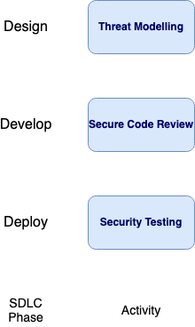

---
  
layout: col-document
title: OWASP Security Culture
tags:

---

# Why adding security in development teams is important

Security should not just be an afterthought, something bolted on at the end.
It is important to add security early in the Software Development Lifecycle 
(SDLC). The earlier security is added into the project, the fewer 
vulnerabilities that will need to be fixed in later stages of the SDLC. 
The cost of fixing security issues increases the further along it is in the 
SDLC[^1].

Rather than only thinking about security at the end of the SDLC, such as
with a penetration test on delivered software, instead security should
be added at each stage. During the Design phase, threat modelling can
help identify possible security issues with a proposed solution
architecture. During the Develop phase, secure code reviews can help
find any vulnerabilities in the source code. During the Deploy phase
security testing, such as automated security tests and penetration
testing, can validate that the deployment is secure.

\
*Figure 2-1: Security Activties by SDLC Phase*

Developers are most appropriate to be responsible for application
security, as they are the ones writing the code[^2]. Developers have
the most understanding of the locations of possible security issues.
However, developers have varying degrees of security knowledge and
experience. It is then essential to add security into the development
process and ensure development team members have the skills necessary to
deliver secure software.

[^1]:  OWASP. *Web Security Testing Guide 4.2.* 2020.
    [*https://github.com/OWASP/wstg/releases/download/v4.2/wstg-v4.2.pdf*](https://github.com/OWASP/wstg/releases/download/v4.2/wstg-v4.2.pdf)*

[^2]:  Ibid., 5.
