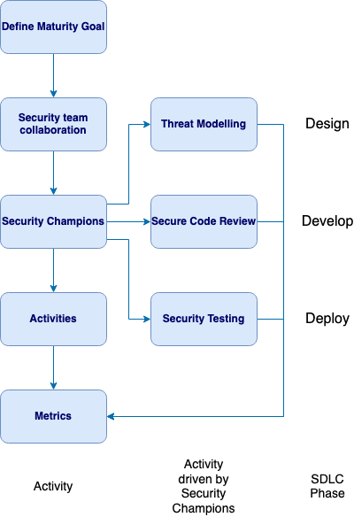

---
  
layout: col-document
title: OWASP Security Culture
tags:

---

# Introduction

This guide will discuss the importance and benefits of establishing a 
security culture when building an application security program.
Security should be considered at each stage of the Software Development 
LifeCycle (SDLC), helping to create secure development practices.

This guide can be used by a broad range of roles: security; developers;
testers and team leaders. The guide does not assume a particular SDLC,
it can be used for any SDLC and software development approach.

This guide will introduce ideas and activities to help uplift security,
such as threat modelling, but does not seek to be an authoritative
source for these activities. References to more comprehensive material
on these activities will instead be provided.

The first step to building an application security program is
defining a **maturity goal** which sets a target to be measured against.
To be able to meet the defined maturity goal, the appropriate resources
need to be assigned. This requires having management buyin. The
importance of security needs to be understood by roles from the
development team manager to the product manager to ensure that security
work can be prioritised accordingly.

**Collaboration** between the security team and development teams is 
essential. The security team expects the development team to write 
secure code, but they need to provide guidance on application security. 
With security team collaboration, security can be distributed across 
the development team.

A good way to distribute security across development teams is by using
\"**Security Champions**\". A Security Champion acts as a point of
contact for the developers to ask security questions. This helps scale
out security, as there are often fewer security team members than
development team members.

**Activities** help build the security mindset into development teams.
Interactive labs and vulnerable by design applications help developers
learn different security vulnerabilities and how to fix them. Capture
the Flag (CTF) events and gamification are interesting and engaging
activities to help build security.

**Threat modelling** is a useful task for developers to use to identify
potential security issues early in the development lifecycle. This task
need not be only performed by security architects, but can be done by
developers in another way to scale out security.

**Security testing** is used to ensure code delivered is secure.
However, tests can be added at multiple stages of the development
lifecycle, not just the end. It is beneficial to involve the development
team in the deployment of the security testing tools used. Ensure that
the tool will provide value and have minimal false positives. It is also
beneficial to have penetration testing reports that are provided to the
development team be free from false positives and give details on how to
remediate particular findings.

Lastly, the use of **metrics** is important to measure progress of the
security uplift. Metrics from the Security Champions program, threat
modelling, code review, security testing, and other activities are all
useful to give an indication of how the application security uplift is
improving over time. This allows adjustments to be made to the overall
program to ensure the defined maturity goals are met.

\
*Figure 1-1: Security Activities Flow Chart*