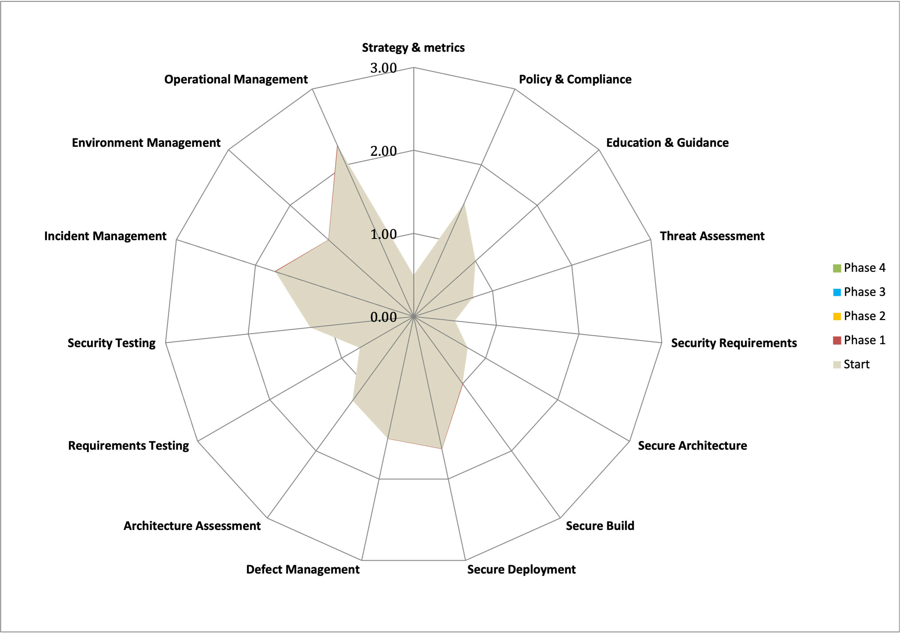

---
  
layout: col-document
title: OWASP Security Culture
tags:

---

# Goal setting and security team collaboration

## Define maturity goal

The first step to building an application security program is 
defining a maturity goal. Use a capability maturity model to measure
current security knowledge and practices, and plan for an uplift. The
particular goals that are set will depend on any security framework or
standard that an organisation must comply with or aspires to achieve
certification in. Use the [OWASP Software Assurance Maturity Model
(SAMM)](https://owasp.org/www-project-samm/) to define the current
state of application security for an organisation, and provide guidance
on improving. Once the maturity model is created the appropriate
resources should be assigned to be able to meet the set goals.

Following the [SAMM](https://owasp.org/www-project-samm/) guide, first
the relevant stakeholders are interviewed to understand the current
security state of practices, with a maturity level assigned for each
practice. Once the current maturity level has been determined, the
next step is to define a maturity target to implement. Planning
utilises a roadmap involving multiple phases that have particular 
targets set for each phase. The roadmap is then communicated across the
organisation and to management stakeholders. As the plan is implemented,
the effectiveness of the improvements is measured.

\
*Figure 3-1: Maturity Level Graph*

## Management buyin and business process

When planning to uplift security it is important to have management
buyin. Having the idea of security as a priority pushed down from the
top of the organisation helps to legitimise the need for security and
have it at the forefront of the minds of all organisation members. Roles
representing the business, such as product owners should also have
buyin. Introducing security awareness at all levels of the organisation
helps work to be prioritised. Development team managers and product
owners will understand security is important and allocate resources to
it.

Security work should be visible and be subject to normal business
processes. By having security work use the same process, providing work
hour estimates and including it in the roadmap alongside other work, it
will ensure that security work is not forgotten about and is assigned
the appropriate resources. The amount of security work to include in a
roadmap will depend on the organisation\'s risk appetite. A financial
organisation will be risk averse and require a significant investment in
security work.

It is useful to have a risk register to track outstanding security
risks. These are reviewed periodically by senior management to accept or
mitigate as per the organisation\'s risk appetite.

## Security and development teams working together

It is important for the security and development teams to work together.
It can often be the case that teams are compartmentalised, working in
silos. Instead, what is needed is collaboration between security and
development teams. The development team may want to ensure they include
security in their process, but do not know where to start and would
benefit from guidance from the security team. Whereas the security team
wants the development team to write secure code, but they may not have
time to dedicate to application security. To address this issue, there
needs to be collaboration between the security and development teams, as
well as security distributed across the development team.

Security teams are often seen as a blocker. Security teams want to
ensure systems are protected, but there is often a tradeoff between
security and convenience. Security teams may default to disallowing a
developer requested functionality. Effective security teams enable,
rather than block[^3].

It is important to keep an open communication channel between the
security team and development team. This could be by having regular
meetings where application security is discussed, with both teams able
to contribute to the discussion. If your organisation uses an instant
messaging tool to communicate, this can be an engaging, visible way to
discuss security for both teams.

A security team member contributing code to a development team codebase
can help build a good relationship between the two teams. This builds
trust by showing the development team that the security team does have
an understanding of writing code. In addition, showing how a
vulnerability can be exploited in the context of an application that the
developers work on can help application security seem relevant and
useful. For example, a security team member may find a Cross-Site
Scripting vulnerability in the developers\' codebase and demonstrate an
exploit. To remediate the vulnerability, they select a particular
library to escape the html output that can be reused by the development
team for this particular issue in future.

The security team should assign an appropriate priority rating when
assigning work to a development team, rather than marking every item as
urgent. Performing a risk assessment and assigning an appropriate risk
rating is important. A risk rating considers the vulnerability and the
impact it would have on the business. This can be calculated, for
example, by using the [OWASP Risk Rating Methodology](https://owasp.org/www-community/OWASP_Risk_Rating_Methodology).
Having a risk rating helps the teams understand which items pose the
most risk. When the development team understands how the risk ratings
are calculated and the impact a particular vulnerability has on the
business, it can be easier for the security team to have the attention
of the development team in the prioritisation of the vulnerabilities
remediation.

Use secure defaults and secure guard rails or paved roads as an
effective way to ensure security is built into the development
process[^4]. Infrastructure used by developers should be set up in a
secure manner, such that no additional work is needed to make the
environment secure. Any modules that developers use should be secure by
default. Rather than provide all options to the development team which
may include insecure options, make available only the secure options
that follow the organisation\'s security policy. Sample secure code or
complete secure modules can be provided to developers to make it easier
for them to integrate into their implementation. This makes the easy way
to do something also the most secure way.

Security teams can ensure new solution architecture designs are secure
by providing developers with sample solution architecture that has the
required security controls in place. Security policies help guide
developers in a secure design, but more beneficial is for the security
team to provide a solution architecture, and ideally a sample
application or code, that includes all the security controls they expect
the developer to use. A developer can then simply take a sample
application or solution architecture and incorporate it in a new
solution, and the security team can be assured that the security
controls they require will be in place.[^5]

The speed at which security is introduced into the development team will
depend on how much time is available to them and their current knowledge
and interest. It is important for management to set aside the
appropriate time for developers to focus on learning security, and for
the security team to provide interesting relevant learning material.
Improving security is a gradual process that needs maintenance and
attention.

[^3]:  Rich Smith, *Agile Application Security*, (USA: O\'Reilly, 2017),
    318.

[^4]:  OWASP, How to start an AppSec program with the OWASP Top 10. 2021. 
    [*https://owasp.org/Top10/A00_2021-How_to_start_an_AppSec_program_with_the_OWASP_Top_10/#stage-2-plan-for-a-paved-road-secure-development-lifecycle*](https://owasp.org/Top10/A00_2021-How_to_start_an_AppSec_program_with_the_OWASP_Top_10/#stage-2-plan-for-a-paved-road-secure-development-lifecycle)

[^5]:  Anunay Bhatt, Uncomplicate Security for Developers using
    Reference Architectures. 2021.
    [*https://ab-lumos.medium.com/embedding-security-into-sdlc-using-reference-architectures-for-developers-29403c00fb3d*](https://ab-lumos.medium.com/embedding-security-into-sdlc-using-reference-architectures-for-developers-29403c00fb3d)
