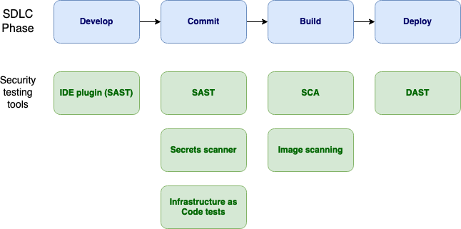

---
  
layout: col-document
title: OWASP Security Culture
tags:

---

# Security testing

Use security tests to verify that the required security controls are in
place, as defined in the security requirements. This chapter will
discuss the selection of security tools; adding security tests into the
development pipeline; the types of testing and tools that can be used;
vulnerability management; and the use of penetration testing. For a
detailed guide on how to conduct security testing refer to the [OWASP
Web Security Testing
Guide](https://owasp.org/www-project-web-security-testing-guide/).

## Using security tools

Care should be taken when selecting and embedding security tools.
Security tools should be easy for a developer to use, ideally embedded
within a developer native tool, rather than be operated solely by an
application security engineer. The security team should tune code
scanner tools to ensure a minimum of false positives are reported such
that the tool provides value, and does not waste the developers\' time.
Too many false positives could lead to developers ignoring true positives.

Security tools should give a good indication of what the found issues
are and how to fix them. Security tool findings can be provided directly
to the developers, to allow for rapid feedback on any security issues.
In some cases it will be necessary first for the security team to
provide an analysis of the findings.

Security tests can be configured to fail a code build if the tests do
not pass. For development on a new codebase it can be useful to add in
security tests from the start, such that developers are used to these
checks.

## Adding security tests into the development pipeline

Security tests have traditionally been conducted after code has been
deployed. However, security tests can also be added in earlier phases of
the SDLC, such as develop and commit[^6]. Security tests can run as
the code is written, with feedback delivered directly in the IDE
(Integrated Development Environment). Security tests can happen at
commit time, checking for known insecure patterns in the source code
before being added to the code repository or merged to the main branch,
this is known as Static Application Security Testing (SAST). Security 
tests are run at build time, such as checking for any vulnerabilities 
in libraries, known as Software Composition Analysis (SCA); or
vulnerabilties in container images. Security tests run at
deploy time, which allows automated testing on a running application,
known as Dynamic Application Security Testing (DAST).

\
*Figure 7-1: Security Testing Tools by SDLC Phase Diagram*

## Types of security tests

This section will provide a list of the OWASP projects that can be used
in the different SDLC phases. See also [Free for Open Source
Application Security
Tools](https://owasp.org/www-community/Free_for_Open_Source_Application_Security_Tools)

### Checks at coding time

-   IDE plugin: part of a Static Application Security Testing (SAST)
    tool that highlights secure coding recommendations in real time
    within the developer\'s Integrated Development Environment as they
    write code

### Tests at commit time

-   Static Application Security Testing (SAST): provides feedback upon
    commit of source code. For more details see [OWASP Source Code
    Analysis
    Tools](https://owasp.org/www-community/Source_Code_Analysis_Tools)
-   Secrets scanner: check for sensitive data such as passwords and api
    keys that may appear in committed source code or configuration files
-   Infrastructure as Code (IaC) analysis: infrastructure resources can
    be defined and created from static files, providing the opportunity
    to run security checks when the files are committed before the
    infrastructure changes are made.

### Tests at build time

-   Software Composition Analysis (SCA): Check for vulnerabilities in
    third party libraries used by the application. For more details see
    [OWASP Component
    Analysis](https://owasp.org/www-community/Component_Analysis)

    -   [OWASP Dependency track](https://owasp.org/www-project-dependency-track/)

    -   [OWASP Dependency check](https://owasp.org/www-project-dependency-check/)

-   Image scanning: Container images can be scanned for vulnerabilities
    before deployment

### Tests at deploy time

-   Dynamic Application Security Testing (DAST): tests performed on the
    running application. Tests can be conducted in a non-production
    environment before moving to production. For more details see
    [OWASP Vulnerability Scanning
    Tools](https://owasp.org/www-community/Vulnerability_Scanning_Tools)

## Penetration testing

A penetration tester plays the role of the attacker to find and exploit
vulnerabilities. This helps provide a more accurate risk rating than
vulnerability scans alone. Although penetration testing occurs at the
end of the SDLC, the results of the penetration test can provide
feedback for tests in the earlier phases. Such as additional rules for
SAST and DAST scanners, and to use SCA to confirm vulnerabilities found
by the penetration test[^7].

A penetration test report should clearly detail found vulnerabilities,
and how to fix them. It is also helpful to show how the vulnerability
was exploited. This helps a developer test that their fix has worked.

A security team needs to help the development team interpret the
penetration test report and provide guidance. An application security
engineer may first check the report to remove any false positives before
assigning developers to address the found vulnerabilities.

## Bug bounty programs

Another approach to discover exploitable vulnerabilities is to implement
a bug bounty program. An organisation with a bug bounty program invites
bug hunters or security researchers to provide vulnerability details in
return for a bounty reward, possibly monetary, for the finding.

It is important to have a well defined program detailing the type of
findings that will be accepted and the systems in scope for testing.

An example bug bounty program can be found at the [OWASP Bug Bounty page](https://owasp.org/www-community/initiatives/bugbounty/)

For more details see the [OWASP Vulnerability Disclosure Cheat Sheet](https://cheatsheetseries.owasp.org/cheatsheets/Vulnerability_Disclosure_Cheat_Sheet.html#bug-bounty-programs)

## Vulnerability management and Application Security Posture Management (ASPM)

As vulnerabilities are identified from security testing tools they need
to be recorded and managed. As mentioned in the threat modelling
section, vulnerabilities should be defined with an Impact and Likelihood
risk rating. Risk ratings use a quantitative rating such as the [OWASP
Risk Rating Methodology](https://owasp.org/www-community/OWASP_Risk_Rating_Methodology),
or qualitative using for example low; medium; high. When vulnerabilities
are assigned a risk rating, this allows their remediation to be
prioritised accordingly. An organisation may implement a required
timeframe that vulnerabilities of a particular risk rating are to be
remediated.

Extending on from Vulnerability management, the goal of Application
Security Posture Management (ASPM) is to prioritise the remediation of
vulnerabilities that will have a business impact. Rather than trying to
fix all vulnerabilities, there should be a focus on remediating the
vulnerabilities with the greatest risk to the organisation. Factors
that can determine a higher risk rating include whether a vulnerability
is exploitable, publicly accessible, or if the vulnerability exists on a
critical asset.  

An Application Security Posture Management tool aggregates
vulnerabilities from various security testing tools. This can be useful
to help build security culture as developers and security engineers will
have a single location to access all vulnerabilities, or all findings
could be exported to a tool that developers are already using. An
Application Security Posture Management tool makes it easier to assign
particular vulnerabilities to relevant teams in an automated way,
for example based on code repository.

-   [OWASP Defect dojo](https://owasp.org/www-project-defectdojo/)

[^6]:  Scott Gerlach, Developer\'s struggle with security, OWASP 20th
    Anniversary. 2021.

[^7]:  Daniel Krasnokucki, Feedback loop in DevSecOps - mature security
    process and dev cooperation, OWASP 20th Anniversary. 2021.