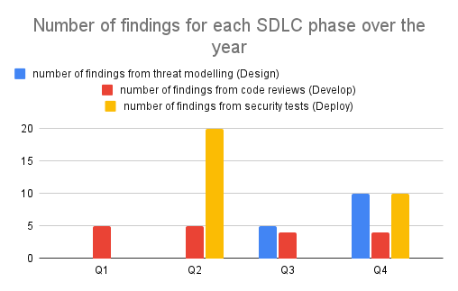

---
  
layout: col-document
title: OWASP Security Culture
tags:

---

# Metrics

Use metrics to measure the progress of the security uplift program.
According to OWASP SAMM metrics \"evaluate the effectiveness and
efficiency of the application security program\"[^8]. Metrics help to
improve the security maturity by measuring the progress on the defined
maturity goals, and allow for adjustments to the security program to
ensure the maturity goals are met.

Metrics are used to tell a story to justify an action, such as a
security budget, and argue for change[^9]. Metrics are a useful tool
to present to management to highlight where there may be gaps in the
organisation\'s security posture that require additional resources to
address, or to show that resources spent on security are having the
desired effect of reducing risk to the organisation.

To start, examine business processes to see where they can be quantified
and measured. Metrics are measured over time, such as quarterly, to show
a trend. It is important to know what the desired direction for the
metric to move is, up or down, and what activity may have caused
significant movement.[^10]

Take note of which Software Development Lifecycle (SDLC) phase has
identified the most security issues. It is more expensive to fix
security issues later in the development cycle.[^11] Aim to identify
issues sooner in the SDLC in accordance with maturity goals.

### Example metrics

#### Design - Threat Modelling

-   number of threat models or threat modelling activities conducted
-   number of findings from threat models

#### Develop - Code Reviews

-   number of code reviews conducted
-   number of findings from code reviews

#### Deploy - Security testing

-   number of findings from penetration testing (internal vs vendor)
-   number of findings from vulnerability scanning
-   number of findings remediated
-   time taken to remediate a vulnerability, does it meet an SLA (An
    organisation may require vulnerabilities to be remediated in a
    certain time frame in accordance with the vulnerabilities risk
    rating)

#### Security team collaboration

-   number of secure by default modules created
-   number of secure architecture designs created and provided to
    developers

#### Security champions

-   number of security champions onboarded

#### Training activities

-   number of training activities introduced to developers
-   number of developers onboarded to training activities
-   number of developers engaged in particular training activities

### Example graph using metrics

\
*Figure 8-1: Example Metrics Graph*

The metric for the number of findings from threat modelling in the
Design phase increases in Q3 upon the threat modelling activity
implementation for the organisation. This metric increase is expected
and desired. The metric further increases in Q4 as the threat modelling
activity is scaled out by Security Champions, an expected and desired
increase.

The metric for the number of findings from security tests increases in
Q2 as a result of a penetration test. This metric increase is expected.
Upon a further penetration test in Q4, the metric has decreased from
it\'s earlier record. This metric change is desired, as it represents a
cost saving. The cost of addressing security findings increases at later
stages of the development lifecycle.

[^8]:  OWASP. *SAMM.*
    [*https://owaspsamm.org/model/governance/strategy-and-metrics/stream-b/*](https://owaspsamm.org/model/governance/strategy-and-metrics/stream-b/)

[^9]:  Marcus Ranum, AppSec California. 2016.
    [*https://www.youtube.com/watch?v=yW7kSVwucSk*](https://www.youtube.com/watch?v=yW7kSVwucSk)

[^10]:  Ibid.

[^11]:  OWASP. *Application Security Guide for CISOs*.
    [*https://owasp.org/www-pdf-archive/Owasp-ciso-guide.pdf*](https://owasp.org/www-pdf-archive/Owasp-ciso-guide.pdf)